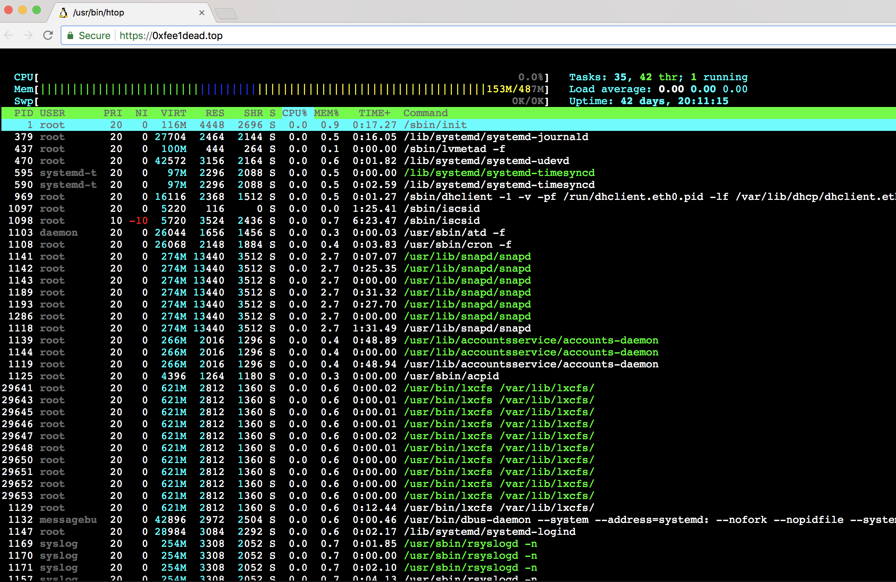

# 0xfee1dead.top

Live `htop` output of a server

## Build

### Prerequisites

* htop
* Node
* [aha](https://github.com/theZiz/aha)
* coreutils

Running `make install` installs the npm modules and the `pm2` cli tool

## Run

```make run``` will run the node `pm2` and `htopgen.sh` to generate the `htop.html` files

## Screenshot



## Thanks

* [krismsd](https://github.com/krismsd) for helping me out with `sockets.io`
* [tobiasahlin](https://github.com/tobiasahlin) for the css spinner
